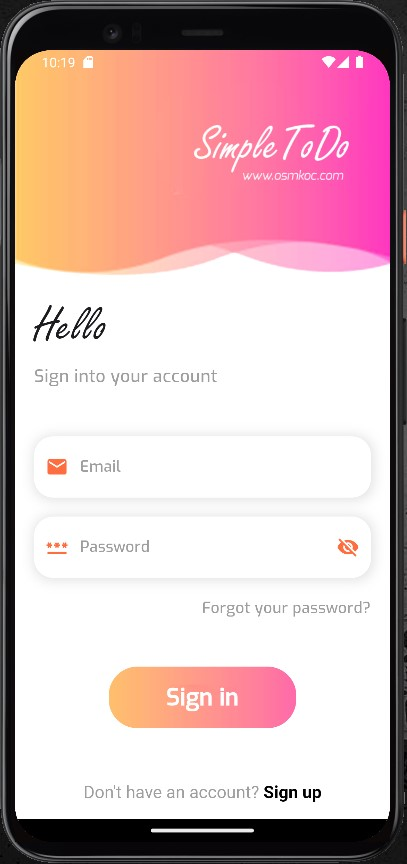
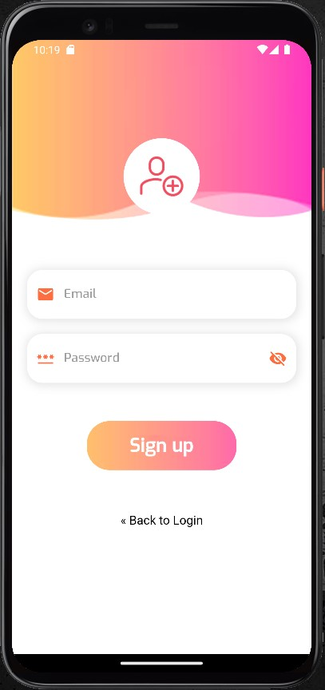
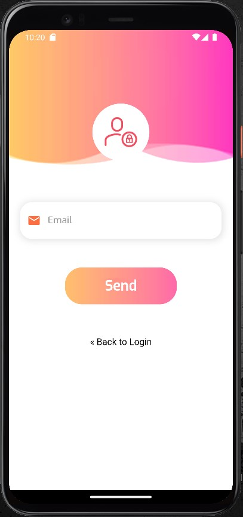
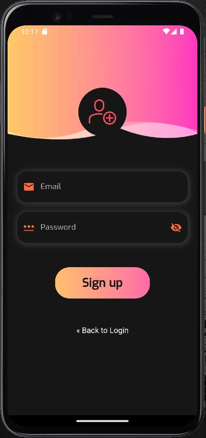
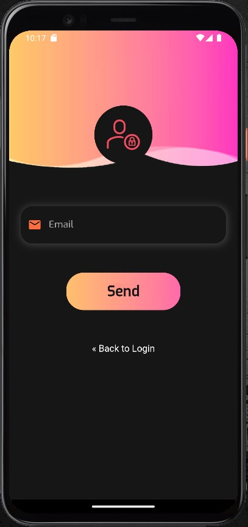
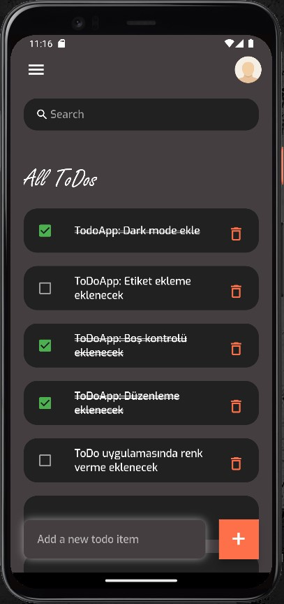

# Simple ToDo App


Welcome to the Simple ToDo App, a quick and easy-to-use task management application built with Flutter. This app allows you to swiftly add, delete, and update tasks, providing a seamless search functionality to find any existing to-do item within the application.

You can download this application from the [Google Play Store](https://play.google.com/store/apps/details?id=com.osmkoc.simpletodo)

## Screenshot

### Light Mode

</img> &nbsp;  &nbsp;  &nbsp; 

### Dark Mode

</img> &nbsp;  &nbsp;  &nbsp; 

## Getting Started
1. Clone the repository:
   ```bash
   git clone https://github.com/osman-koc/simple-todo-app.git
   ```
2. Navigate to the project directory:
   ```bash
   cd simple-todo-app
   ```
3. Running the app:
   ```bash
   flutter pub get
   ```
   ```bash
   flutter run
   ```

## Features
1. **Task Management:**
   - Users can register and log in to the app.
   - Tasks can be added through a single-screen interface.
   - Users can mark tasks as completed by tapping the checkbox, which crosses out the task.
2. **Task Viewing:**
   - All tasks are visible on a single screen for easy access.
   - Quick task search is possible through the search box at the top.
3. **Multilingual Support:**
   - The app supports two languages: Turkish and English.
   - The app automatically opens in the phone's language. If the language is other than Turkish or English, the default language is English.
4. **User Account Integration:**
   - Added tasks are saved in the user's account.
   - Users can retrieve their tasks even after reinstalling the app or logging in from another device.
5. **Technology Stack:**
   - The app is developed using Flutter.
   - Task data is securely saved using Firebase.
6. **Future Enhancement:**
   - An upcoming feature will allow users to categorize tasks for better organization.

## Acknowledgments
- Original Repository: [itzpradip/flutter-todo-app](https://github.com/itzpradip/flutter-todo-app) by [Pradip Debnath](https://github.com/itzpradip)
- Reference for the login screen from: [dbestech](https://www.youtube.com/watch?v=o_ZeLqpqt90)

<br />
Thank you for choosing the Simple ToDo App. Happy tasking!
